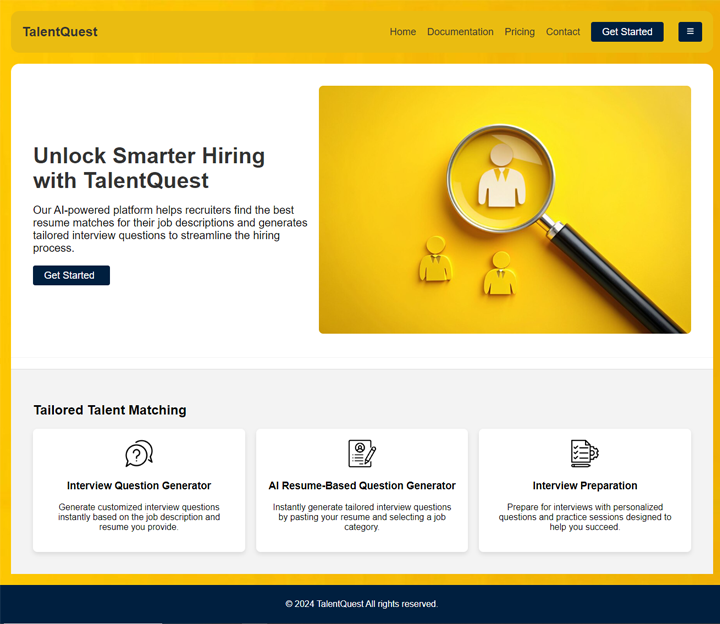
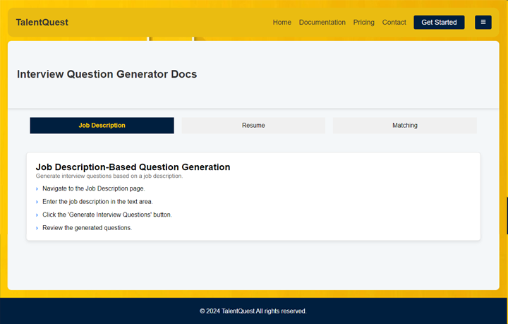

# TalentQuest -  AI-Powered Interview Prep Platform 


##  About TalentQuest

TalentQuest is a web application built with Flask and React that empowers users to prepare for technical interviews using AI-powered tools. The platform assists both candidates and recruiters by providing:

**For Candidates:**

* **Resume Matching:** Analyze a candidate's resume against a given job description using  semantic similarity to determine the candidate's relevance.
* **AI-Powered Question Generation:** Generate interview questions tailored to a candidate's skills and experience, extracted from their resume.
* **Interview Question Feedback:** Get instant feedback on answers to practice questions, helping to improve communication and clarity.
* **Resume-to-Question Generation:** Quickly generate interview questions based on a candidate's resume, for a personalized preparation experience.

**For Recruiters:**

* **Generate Job Interview Questions:**  Create targeted interview questions based on specific job descriptions, ensuring alignment with hiring requirements.

## Getting Started

1. **Clone the Repository:**
   bash
   git clone https://github.com/ZakariaBenlamkadam/Nlp-recrutement


2. **Install Dependencies:**

### Backend (Flask):


```bash
  cd /flask-server
  pip install -r requirements.txt
````
    

### Frontend (React):
```bash
cd /client
npm install
```
### Create Database:

Create a database3.db file in the backend directory.

Run the following command to create the database tables:
```bash
python app.py
```

Replace the placeholder groq_api_key in the backend/app.py file with your actual Groq API key.

3.** Run the Application:**

### Backend:
```bash
cd /flask-server
python mainserver.py
```
### Frontend:
```bash
cd /client
npm start
```

The application will be accessible at http://localhost:5000 (backend) and http://localhost:3000 (frontend).

4.**Technologies Used**
### Backend:

* **Flask (Python web framework)**

* **LangChain Groq (Large Language Model integration)**

* **ChromaDB (Vector database)**

* **SQLite3 (Database)**

* **Flask-Login (User authentication)**

* **Bcrypt (Password hashing)**

### Frontend:

* **React (JavaScript library)**

* **React Router Dom (Routing)**

* **MUI (Material-UI) (UI components)**

* **PrimeReact (UI components)**

* **React-Query (Data fetching)**

* **Axios (HTTP requests)**

## Project Architecture
<div align="center">

  

</div>


## Project Screenshot
<div align="center">


  
  
  
  
  
  
  
  
  
  
  
  

</div>


